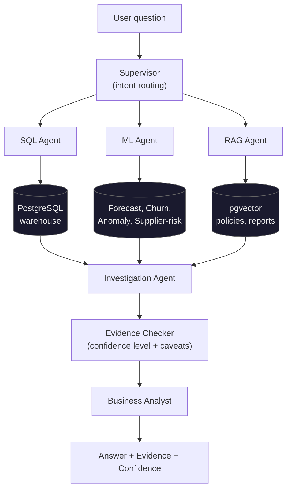

# NEXUS — Agentic Business Intelligence Platform

**An AI analyst that investigates why, not just what — built on a real data warehouse, with document-grounded evidence and an honest confidence level on every answer.**

   

## The problem this solves

Most "chat with your data" demos stop at translating a question into SQL. NEXUS goes a step further: a supervisor routes a business question to a SQL agent (warehouse), an ML agent (trained models) and a RAG agent (business documents in pgvector). An investigation step merges the results, an evidence checker sets a confidence level and flags missing corroboration, and a business analyst writes the answer, separating correlation from causation.

## Architecture



*Not yet built: chart output, multi-step investigation, and LangGraph orchestration — see
the roadmap below. The diagram above reflects what actually runs today, not the full
blueprint vision.*

## Status (only what has been run and observed)

| Component | Status | Notes |
|---|---|---|
| Ingestion + star schema (`dim_*`, `fact_*`) | Working | 8 CSVs, 100,000 transactions, referential checks pass |
| KPI views + Streamlit dashboard | Working | Sales, customers, returns, operations, marketing |
| `/investigate` (SQL + RAG, Gemini) | Working | Answers grounded in warehouse rows and retrieved documents |
| Ask tab in the dashboard | Working | Calls `/investigate` from inside the dashboard |
| ML models | Trained, baseline quality | See metrics below; not yet tuned or wired into routing |
| Supervisor | Plain Python | LangGraph is in `requirements.txt` but not used yet |
| Chart output from the agent | Not built | |
| Internal benchmark | Not run | 6 sample questions exist, no ground truth yet |
| BI-Bench | 30% (6/20), one pilot run | 20-case size-capped pilot, baseline agent, no data-management tools. See `docs/bibench_pilot.md`. Comparable paper baselines: GPT-4o 27.1%, DeepSeek-V4-Pro 23.5% (SQL, no-tool) |
| AWS deployment | Not deployed | Terraform written, never applied |

### Measured ML baselines (single run, time-based split for forecasting)

| Model | Result |
|---|---|
| Demand forecast (XGBoost) | MAE 7.39, RMSE 10.69, RMSPE 1.71 |
| Churn (Random Forest) | ROC-AUC 0.730, F1 0.661 (time-based split) |
| Anomaly detection (Isolation Forest) | 33 of 1,096 days flagged, mostly December peaks |
| Supplier risk | Rule-based (SQL view), not a classifier | Previous classifier was circular (label and features overlapped); see `train_supplier_risk.py` |

These are first-pass numbers on a synthetic dataset, not production claims.

## Key design decisions

- **`price_elasticity` is never a model feature.** It is a fixed constant per product in the raw data, so training on it would leak the label. It is used only as a validation check.
- **Protected attributes never reach a model.** `gender`, `age`, `country` are stripped before feature frames are built; small subgroups get a low-confidence flag.
- **The SQL agent is read-only by construction:** a dedicated Postgres role with SELECT-only grants, plus a validator that blocks write keywords, unknown tables and queries without a LIMIT, with a statement timeout.
- **Confidence is evidence-based.** It rises when SQL and document evidence agree, and the analyst is told to separate correlation from causation. It does not perform formal causal inference.

## Data (not included in this repo)

The dataset is not committed. Download **Global E-Commerce & Supply Chain Database** from Kaggle (`parsakh/global-e-commerce-and-supply-chain-database`) and place the 8 CSVs in `data/raw/`:

```bash
pip install kaggle          # needs ~/.kaggle/kaggle.json
kaggle datasets download -d parsakh/global-e-commerce-and-supply-chain-database
unzip global-e-commerce-and-supply-chain-database.zip -d data/raw/
```

## Quick start

```bash
git clone https://github.com/rohitsharma2408/NEXUS.git && cd NEXUS
cp .env.example .env        # set LLM_PROVIDER, LLM_MODEL and the matching API key
docker compose up -d --build

# load data and build the warehouse (psql lives in the postgres container; -T is required for piped input)
docker compose exec api python project2_analytics/ingestion/load_csv_to_postgres.py
docker compose exec -T postgres psql -U nexus_user -d nexus_db < project2_analytics/sql/schema_star.sql
docker compose exec -T postgres psql -U nexus_user -d nexus_db < project2_analytics/sql/kpi_views.sql
docker compose exec -T postgres psql -U nexus_user -d nexus_db < project1_agentic/rag/pgvector_setup.sql

# train models, then load the sample business documents for RAG
docker compose exec api python project2_analytics/ml/train_all.py
docker compose exec api python project1_agentic/rag/ingest_documents.py
```

- Dashboard: http://localhost:8501 (start on the **Ask the Analyst** tab)
- API docs: http://localhost:8000/docs

**LLM providers:** set `LLM_PROVIDER` to `gemini`, `groq`, `openai` or `anthropic`. Model names change; list what your key can use rather than guessing. The Gemini free tier is rate-limited (each question makes several LLM calls).

**Data range:** the dataset spans Jan 2022 – Dec 2024, so ask about specific periods, not "last month".

## Project structure

```
project2_analytics/   ingestion, star schema + KPI SQL, ML training, dashboard
project1_agentic/     supervisor, SQL/ML/RAG agents, evidence checker, FastAPI app, RAG documents
evaluation/           internal benchmark + BI-Bench pilot runner (20-case pilot: 30%)
deployment/           Dockerfiles, AWS Terraform, CI/CD
docs/                 architecture notes
```

## Roadmap

- [ ] Real BI dashboards (Metabase) alongside the fixed Streamlit views
- [x] SQL agent retries failed queries with the real error fed back (main app + BI-Bench pilot)
- [ ] Agent returns charts; multi-step investigations
- [ ] Rework the ML layer (proper labels, tuning, saved metrics, persistent MLflow)
- [ ] Internal benchmark with ground-truth answers
- [x] BI-Bench pilot (20 cases, 30%) — scale to the ~50 cases under 25MB, or run "+tools" mode
- [ ] Deploy to AWS with the existing Terraform (roughly $30–60/month if left running)
